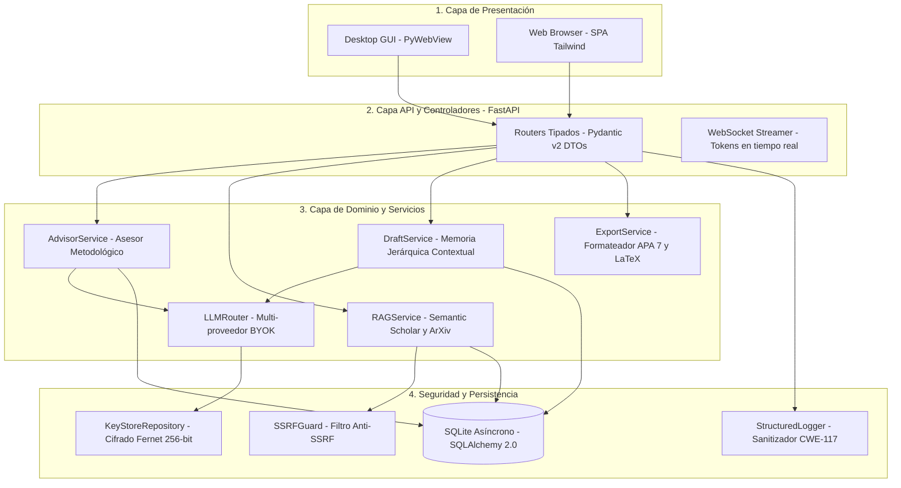
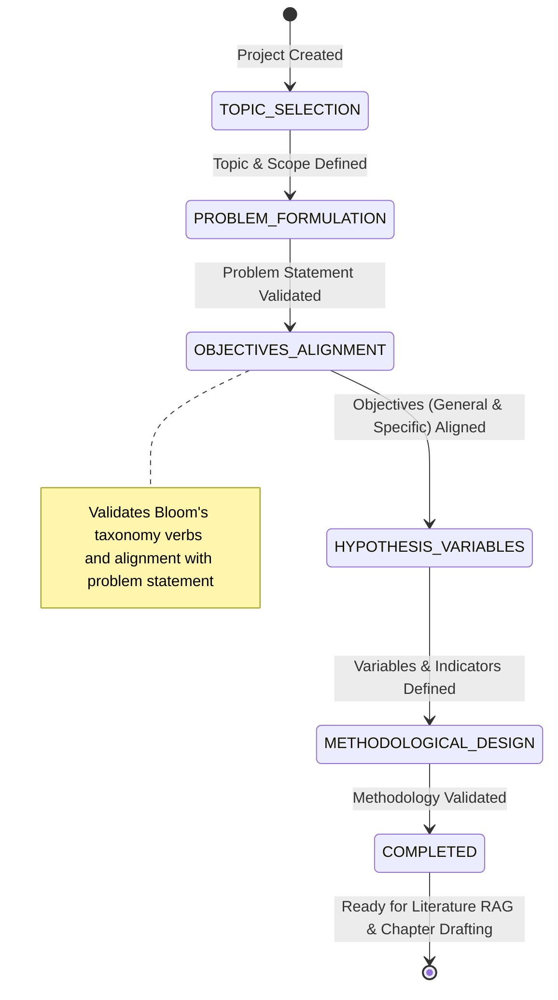
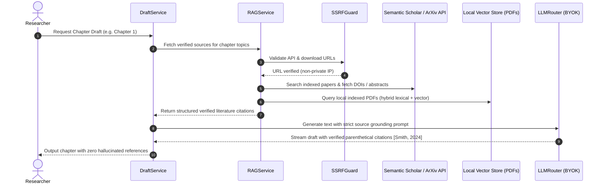

# ThesisForge Architecture Deep Dive 🏗️

This document details the architectural design, security boundaries, and data flow of **ThesisForge**.

---

## 1. High-Level Architecture Overview

ThesisForge is built as a modular, local-first research platform with a strict **Three-Layer Unidirectional Architecture**:

---

## 2. Methodological Advisor State Machine

The research formulation workflow enforces methodological consistency using a strict deterministic state machine:

---

## 3. Anti-Hallucination Literature RAG Pipeline

To prevent fabricated citations and non-existent DOIs, ThesisForge implements a dual-verification retrieval pipeline:

---

## 4. Security & Defense-in-Depth

### 4.1 Server-Side Request Forgery (SSRF) Guard
- All outgoing network requests initiated when downloading research papers or interacting with custom LLM endpoints pass through `SSRFGuard.validate_url()`.
- Resolves DNS hostname to IP address prior to connection.
- Rejects connections if the target IP falls into private or restricted subnets (`127.0.0.0/8`, `10.0.0.0/8`, `172.16.0.0/12`, `192.168.0.0/16`, `169.254.0.0/16`, `::1/128`).

### 4.2 Local Key Vault Encryption
- User-provided BYOK API keys (OpenAI, Anthropic, Gemini, OpenRouter) are encrypted at rest using 256-bit symmetric Fernet encryption before persisting to SQLite.
- Keys are decrypted only transiently in memory during request dispatching.

### 4.3 Log Injection (CWE-117) & Formula Injection Defense
- User input is sanitized to remove CR/LF characters before writing to logs.
- Document and tabular export routines prefix formula triggers (`=`, `+`, `-`, `@`) with apostrophes to protect researchers opening files in Microsoft Word or Excel.
