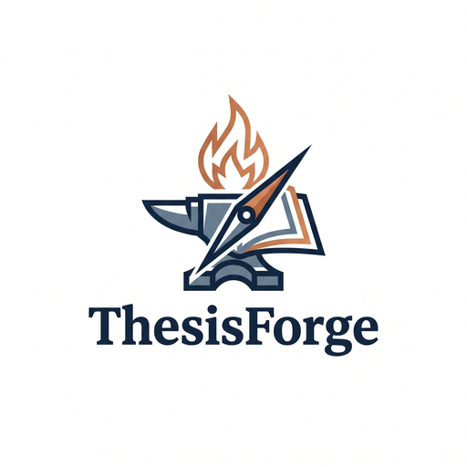
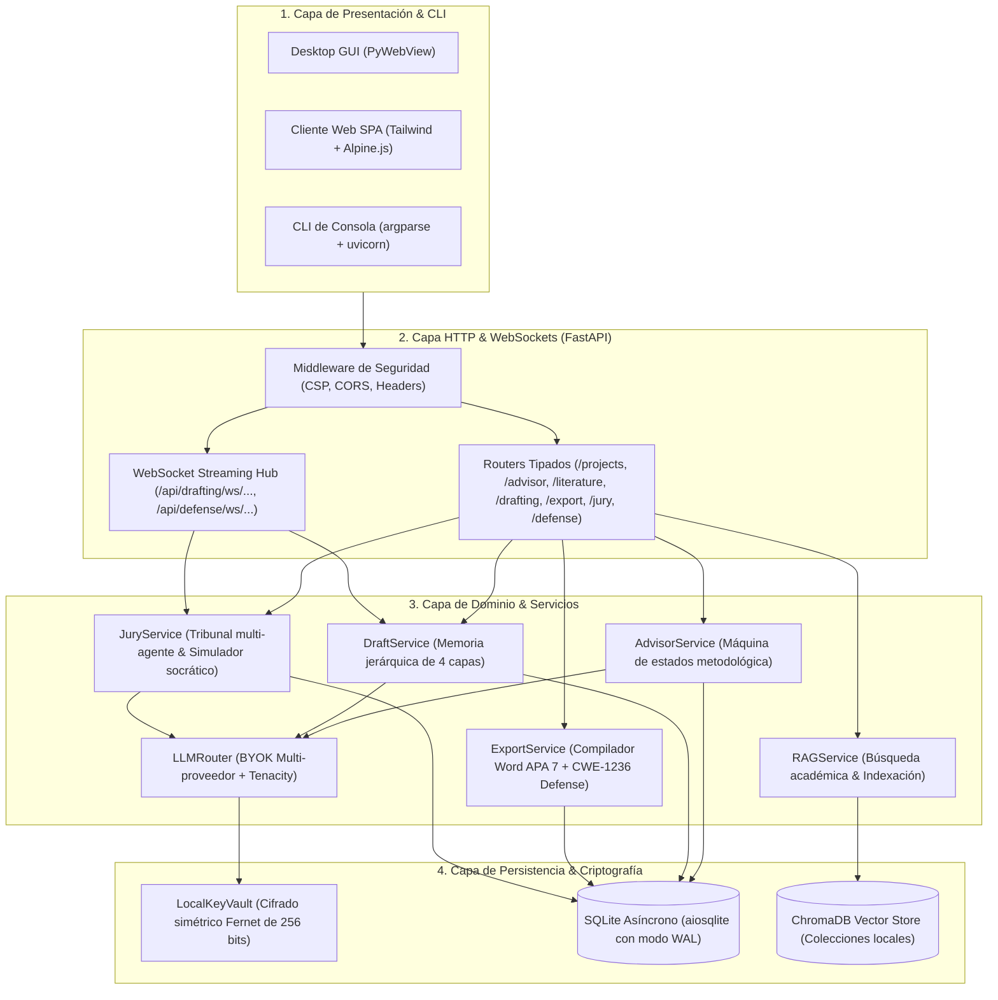

<p align="center">
  <picture>
    <source media="(prefers-color-scheme: dark)" srcset="assets/logo_dark.png">
    <source media="(prefers-color-scheme: light)" srcset="assets/logo_light.png">
    
  </picture>
</p>

<h1 align="center">ThesisForge</h1>

<p align="center">
  <em>Asistente y forjador de proyectos de investigación académica con inteligencia artificial, búsqueda de literatura real indexada (RAG) y redacción modular por capítulos bajo normas APA 7ª edición. 100% compatible con tus propias claves de API (BYOK) y modelos locales.</em>
</p>

<p align="center">
  <a href="https://opensource.org/licenses/Apache-2.0"></a>
  <a href="https://www.python.org/downloads/"></a>
  <a href="https://github.com/astral-sh/ruff"></a>
  <a href="https://mypy.readthedocs.io/"></a>
  <a href="https://github.com/PyCQA/bandit"></a>
  <a href="https://github.com/oscarbol09/thesisforge/releases"></a>
</p>

---

## Por qué existe esto

Los estudiantes de pregrado, posgrado e investigadores enfrentan tres fricciones fundamentales al apoyarse en modelos de lenguaje comerciales para redactar trabajos de grado:

1. **Enfoque metodológico endeble:** Dificultad para delimitar preguntas de investigación, hipótesis contrastables y taxonomía de objetivos coherentes con el diseño del estudio.
2. **Referencias bibliográficas alucinadas:** Los LLMs generalistas inventan autores, años y DOIs inexistentes, invalidando el rigor científico del manuscrito.
3. **Pérdida de coherencia inter-capítulo:** Generar documentos de 50 o 100 páginas en un único prompt satura la ventana de contexto y desconecta las conclusiones del marco teórico.

ThesisForge estructura la elaboración del proyecto a través de cuatro etapas secuenciales con puntos de control humanos obligatorios:

$$\text{Asesor Metodológico} \longrightarrow \text{Literatura RAG} \longrightarrow \text{Redacción Modular (APA 7)} \longrightarrow \text{Jurado & Defensa Oral}$$

---

## Comparativa técnica

| Característica | ThesisForge | NotebookLM | Jenni AI / SciSpace | Chatbots Comerciales |
| :--- | :---: | :---: | :---: | :---: |
| **Control de claves (BYOK)** | Sí (OpenRouter, Gemini, Groq, Ollama) | No (Ecosistema Google) | No (Suscripción propietaria) | No (Suscripción propietaria) |
| **Modelos locales (Ollama)** | Soportado | No | No | No |
| **Entrevista metodológica guiada** | Sí (Máquina de estados finita) | No (Prompt libre) | Parcial | No |
| **Verificación bibliográfica** | RAG con Semantic Scholar / CrossRef | Parcial | Sí | Alucinaciones frecuentes |
| **Contexto jerárquico por capítulos** | Sí (Memoria de 4 capas por sección) | No (Chat plano) | Parcial | Pérdida de contexto |
| **Jurado multi-agente & defensa oral** | Sí (4 roles académicos + Socrático) | No | No | No |
| **Formato de exportación** | Word (`.docx`) APA 7ª edición estructurado | Markdown plano | Limitado en plan gratuito | Texto sin formato |
| **Licencia de software** | Código abierto (Apache 2.0) | Propietario / Freemium | Comercial (\$12–\$30/mes) | Comercial (\$20/mes) |

---

## Inicio rápido

### Requisitos previos
- Python `>= 3.10`
- [uv](https://github.com/astral-sh/uv) (recomendado) o `pip`

### Instalación para desarrollo

```bash
# 1. Clonar el repositorio
git clone https://github.com/oscarbol09/thesisforge.git
cd thesisforge

# 2. Crear entorno virtual con uv
uv venv .venv
# En Windows:
.venv\Scripts\activate
# En Linux / macOS:
source .venv/bin/activate

# 3. Instalar dependencias del proyecto y herramientas de calidad
uv pip install -e ".[dev]"

# 4. Configurar variables de entorno iniciales
cp .env.example .env
cp config.yaml.example config.yaml
```

### Ejecución de pruebas y verificación de calidad

```bash
# Suite de pruebas con reporte de cobertura
pytest tests/ -v --cov=thesisforge --cov-report=term-missing

# Chequeo estricto de tipos y linter
mypy --strict src/
ruff check src/ tests/
bandit -r src/ -ll
```

---

## Uso desde la línea de comandos (CLI)

```bash
# Iniciar el servidor API local
thesisforge run --port 8000

# Buscar literatura real con citas en formato APA 7
thesisforge search-papers "machine learning in healthcare" --limit 5 --format apa

# Inicializar esquema de 5 capítulos para un proyecto
thesisforge draft-init --project-id "proj-123"

# Listar avance capitular y estado de borradores
thesisforge draft-list --project-id "proj-123"

# Compilar proyecto a Microsoft Word (.docx) APA 7ª edición
thesisforge export-docx --project-id "proj-123" --output "./tesis_final.docx" --author "Valeria Mendoza"

# Auditar proyecto con tribunal multi-agente (Metodólogo, Especialista, Estadístico, Abogado del Diablo)
thesisforge jury-audit --project-id "proj-123" --save

# Iniciar simulador socrático interactivo de defensa oral en consola
thesisforge defense-start --project-id "proj-123" --turns 4
```

---

## Arquitectura del sistema

ThesisForge implementa una arquitectura en capas desacopladas con flujo de datos unidireccional:



Consulta [`ARCHITECTURE.md`](ARCHITECTURE.md) y [`docs/user-guide/MANUAL_DE_USUARIO.md`](docs/user-guide/MANUAL_DE_USUARIO.md) para un desglose exhaustivo.

---

## Principios de ingeniería y seguridad

- **I/O no bloqueante:** Toda operación de red y persistencia es asíncrona (`httpx.AsyncClient`, `aiosqlite`, `aiofiles`).
- **Defensa en profundidad contra SSRF:** Resolución de DNS y bloqueo estricto de direcciones IP en subredes privadas RFC 1918 (`127.0.0.0/8`, `10.0.0.0/8`, `192.168.0.0/16`, `169.254.0.0/16`, `::1/128`).
- **Cifrado local en reposo:** Las credenciales de proveedores BYOK se cifran con Fernet (AES-128-CBC + HMAC-SHA256) antes de almacenarse en la base de datos.
- **Sanitización de logs (CWE-117):** Registro estructurado en formato JSON con neutralización de saltos de línea y enmascaramiento de tokens y claves.
- **Defensa contra Formula Injection (CWE-1236):** Toda celda de datos que comience con caracteres ejecutables (`=`, `+`, `-`, `@`, `\t`, `\r`) es neutralizada al exportar a tablas Word/Excel.

---

## Limitaciones conocidas y trade-offs

- **Persistencia en nodo único:** El almacenamiento utiliza SQLite local con WAL mode; está optimizado para flujos monousuario de escritorio y servidores autónomos, no para clústeres distribuidos multirregión.
- **Límites de peticiones en APIs académicas:** Las consultas a Semantic Scholar y CrossRef dependen de los límites de velocidad (*rate limits*) de sus endpoints públicos sin autenticación institucional.
- **Soporte de sistemas operativos para PyWebView:** La versión de escritorio empaquetada como ejecutable autónomo requiere WebView2 en Windows y WebKit2GTK en Linux.

---

## Roadmap

- [x] **Sprint 0:** Fundaciones de seguridad, modelos Pydantic v2, configuración BYOK y repositorio base.
- [x] **Sprint 1:** Router LLM multi-proveedor con reintentos Tenacity, máquina de estados del asesor metodológico y API REST.
- [x] **Sprint 2:** Motor RAG de literatura académica (Semantic Scholar, ArXiv, CrossRef), extracción de PDFs con PyMuPDF, compuerta anti-alucinaciones e indexación local con ChromaDB (v0.2.0).
- [x] **Sprint 3:** Generador modular por capítulos con memoria acumulativa jerárquica, streaming por WebSockets, compilador APA 7 DOCX con defensa CWE-1236 y Manual de Usuario oficial (v0.3.0).
- [x] **Sprint 4:** Panel multi-agente de simulación de jurado y defensa de tesis (v0.4.0).
- [ ] **Sprint 5:** Interfaz de usuario SPA con Tailwind CSS y lanzador de escritorio con PyWebView.
- [ ] **Sprint 6:** Empaquetado ejecutable autónomo (.exe, .dmg, AppImage) y distribución en PyPI (v1.0.0).

---

## Licencia

Este proyecto está distribuido bajo la licencia **Apache 2.0**. Consulta el archivo [`LICENSE`](LICENSE) para más detalles.

Copyright (c) 2026 Oscar Madera / ThesisForge Contributors.
