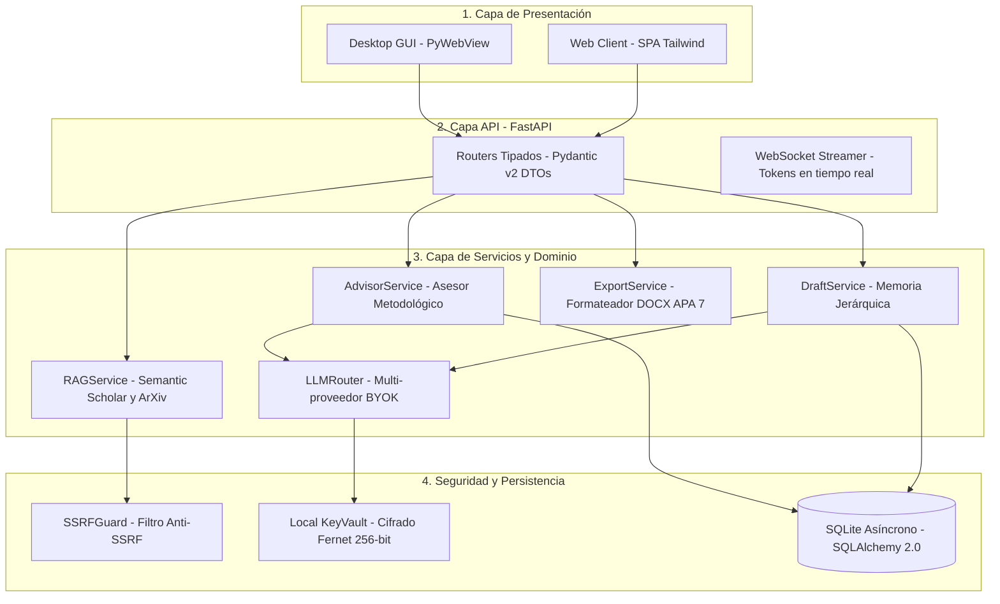

<div align="center">

# 🔨 ThesisForge

### Asistente y Forjador de Investigación Académica con IA, RAG y BYOK

[](https://github.com/oscarbol09/thesisforge/actions/workflows/ci.yml)
[](https://opensource.org/licenses/Apache-2.0)
[](https://www.python.org/downloads/)
[](https://github.com/astral-sh/ruff)
[](https://mypy.readthedocs.io/)
[](https://github.com/PyCQA/bandit)
[](CONTRIBUTING.md)
[](https://github.com/oscarbol09/thesisforge/issues?q=is%3Aissue+is%3Aopen+label%3A%22good+first+issue%22)

**Cero citas inventadas • Orientación metodológica paso a paso • Exportación nativa APA 7ª edición • 100% BYOK y Local-First**

[Documentación](https://oscarbol09.github.io/thesisforge/) • [Inicio Rápido](#-inicio-rápido) • [Arquitectura](ARCHITECTURE.md) • [Roadmap](ROADMAP.md) • [Reportar Bug](https://github.com/oscarbol09/thesisforge/issues/new/choose)

---

</div>

<!-- DEMO PREVIEW -->
<p align="center">
  
</p>
<p align="center">
  <em>De la pregunta de investigación a la exportación en Word APA 7 en minutos, con literatura real indexada de Semantic Scholar y ArXiv.</em>
</p>

---

## 🎯 ¿Por Qué ThesisForge?

Los estudiantes de pregrado, posgrado e investigadores enfrentan **tres fricciones críticas** al usar IA genérica en el ámbito académico:

1. **Enfoque Metodológico Débil:** Dificultad para formular preguntas formales, hipótesis y objetivos delimitados que respeten la taxonomía científica.
2. **Citas Inventadas y Alucinaciones:** Los chatbots comerciales inventan papers y DOIs inexistentes, destruyendo el rigor académico.
3. **Inconsistencia entre Capítulos:** Generar textos extensos en un solo prompt degrada el contexto, desconectando la metodología de los objetivos.

**ThesisForge** forja el proyecto de investigación a través de un flujo estructurado:  
$$\text{Orientación Metodológica (Entrevista)} \longrightarrow \text{Contextualización (RAG Científico)} \longrightarrow \text{Redacción Modular por Capítulos (APA 7)}$$

---

## 🆚 Tabla Comparativa vs Alternativas

| Característica | **ThesisForge** | **NotebookLM** | **Jenni AI / SciSpace** | **ChatGPT Plus** |
|:---------------|:---------------:|:--------------:|:-----------------------:|:----------------:|
| **Privacidad & BYOK (Tus Propias Keys)** | ✅ **100%** | ❌ Solo Google | ❌ Suscripción cerrada | ❌ Suscripción cerrada |
| **Modelos 100% Locales (Ollama / VLLM)** | ✅ **Soportado** | ❌ | ❌ | ❌ |
| **Entrevista Metodológica Guiada** | ✅ **Máquina de estados** | ❌ Prompt libre | 🟡 Parcial | ❌ Sin estructura |
| **Cero Alucinaciones en Citas** | ✅ **RAG con DOIs reales** | 🟡 Parcial | ✅ | ❌ Alucina referencias |
| **Memoria Modular por Capítulos** | ✅ **Contextual chunking** | ❌ 1 solo chat | 🟡 Parcial | ❌ Pérdida de contexto |
| **Exportación Nativa APA 7 (.docx)** | ✅ **Completa con portada** | ❌ Markdown plano | 🟡 Con pago | ❌ Texto plano |
| **Licencia & Costo** | ✅ **Gratis / Apache 2.0** | Freemium | \$12 – \$30 / mes | \$20 / mes |

---

## 🚀 Inicio Rápido

### Opción 1: Instalación vía Pip (Python 3.10+)

```bash
# 1. Instalar ThesisForge
pip install thesisforge

# 2. Iniciar servidor API y abrir interfaz
thesisforge run
```

### Opción 2: Desarrollo con `uv` (Recomendado)

```bash
# 1. Clonar el repositorio
git clone https://github.com/oscarbol09/thesisforge.git
cd thesisforge

# 2. Crear y activar entorno virtual
uv venv .venv
source .venv/bin/activate    # En Windows: .venv\Scripts\activate

# 3. Instalar dependencias en modo editable
uv pip install -e ".[dev]"

# 4. Iniciar la aplicación
python -m thesisforge.cli run --reload
```

### Opción 3: Despliegue con Docker (Self-Hosted)

```bash
docker compose up -d
```
Accede inmediatamente en `http://localhost:8000`.

---

## 🏗️ Arquitectura del Sistema

ThesisForge aplica una arquitectura estricta en 3 capas unidireccionales y principios de ingeniería para producción:



---

## 🛡️ Principios de Ingeniería & Seguridad

- ⚡ **Sin Bloqueo de Event Loop:** Todo el I/O es 100% asíncrono (`httpx.AsyncClient`, `aiofiles`, `aiosqlite`).
- 🛡️ **Defensa contra SSRF:** Verificación de resolución DNS y bloqueo estricto de subredes privadas (`127.0.0.0/8`, `10.0.0.0/8`, `192.168.0.0/16`, `169.254.0.0/16`, `::1/128`).
- 🔐 **Bóveda de Claves Local:** Cifrado simétrico Fernet (256 bits) para claves BYOK en reposo dentro de SQLite.
- 🧼 **Sanitización CWE-117:** Logs estructurados inmunes a Log Injection.
- 📊 **Protección contra Formula Injection:** Sanitización de celdas con caracteres de comando (`=`, `+`, `-`, `@`) en exportaciones.
- 🧪 **Testing Hermético:** Pruebas unitarias, de integración con `respx` y pruebas basadas en propiedades con `Hypothesis`.

---

## 🗺️ Roadmap de Desarrollo

- [x] **v0.1.0:** Asesor Metodológico (Máquina de estados), Router BYOK y Core de Seguridad.
- [ ] **v0.2.0:** Motor RAG de literatura real (Semantic Scholar, ArXiv, CrossRef + PDFs locales).
- [ ] **v0.3.0:** Redacción modular por capítulos con memoria acumulativa y exportación DOCX APA 7.
- [ ] **v1.0.0:** Binarios de escritorio standalone (.exe/.dmg), exportador LaTeX y sincronización con Zotero.

Consulta nuestro [ROADMAP.md](ROADMAP.md) para más detalles.

---

## 🤝 Cómo Contribuir

¡Agradecemos enormemente las contribuciones de la comunidad! Revisa nuestra [Guía de Contribución](CONTRIBUTING.md) para conocer las áreas de trabajo prioritarias (nuevos conectores académicos, soporte para estilos IEEE/Vancouver, etc.).

---

## ⭐ Apoya la Investigación Abierta

Si **ThesisForge** te resulta útil para tu tesis, proyecto de grado o investigación, considera darle una ⭐ en GitHub. ¡Ayuda a que más investigadores descubran una alternativa rigurosa, ética y libre de suscripciones!

[](https://github.com/oscarbol09/thesisforge)

---

## 📄 Licencia

Este proyecto está bajo la Licencia **Apache 2.0**. Consulta el archivo [LICENSE](LICENSE) para más detalles.

Copyright (c) 2026 Oscar Madera / ThesisForge Contributors.
