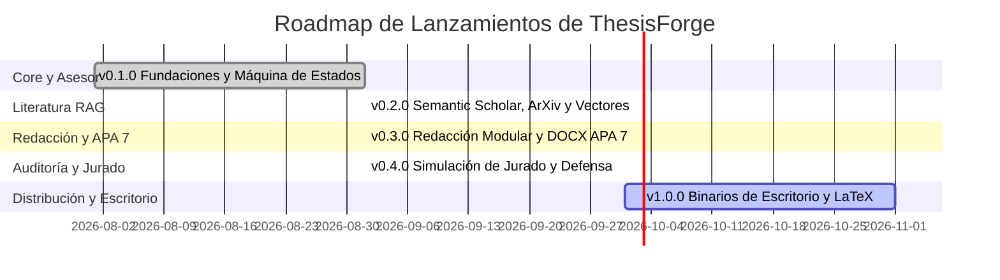

# Roadmap del Proyecto

Este documento describe el plan estratégico de desarrollo técnico y evolución de **ThesisForge**.

---

## Declaración de Visión

Permitir a estudiantes de pregrado, posgrado e investigadores estructurar proyectos de grado rigurosos, libres de alucinaciones y con coherencia metodológica estricta mediante IA explicable, búsqueda indexada de literatura científica real (RAG), redacción modular asistida y control total de sus datos (BYOK y local-first).

---

## Fases de Lanzamiento

---

### Fase 1: Fundaciones y Asesor Metodológico (v0.1.0) — [Completada]
- [x] Arquitectura asíncrona moderna con FastAPI, Pydantic v2 y SQLAlchemy 2.0 / aiosqlite.
- [x] Asesor Metodológico guiado por máquina de estados determinista para planteamiento del problema, objetivos y consistencia de hipótesis.
- [x] Router LLM multi-proveedor BYOK (LiteLLM, OpenRouter, Gemini, Groq, Ollama, OpenAI, Anthropic) con políticas de reintento.
- [x] Core de seguridad AppSec: SSRF Guard, cifrado local de claves con Fernet y logging estructurado JSON con prevención CWE-117.
- [x] Matriz de pruebas CI/CD hermética en Python 3.10–3.12 (Ubuntu, Windows).

---

### Fase 2: Motor RAG y Búsqueda de Literatura Real (v0.2.0) — [Completada]
- [x] Conectores asíncronos directos para **Semantic Scholar Graph API**, **ArXiv** y **CrossRef**.
- [x] Almacenamiento vectorial local (ChromaDB) para artículos PDF cargados por el usuario.
- [x] Chunking contextual léxico y semántico (1500 caracteres, 200 de solapamiento).
- [x] Compuerta anti-alucinaciones con verificación de DOI antes de sugerir citas y evaluación de evidencia.
- [x] Formateador estricto de citaciones en texto y referencias bajo normas APA 7ª edición.

---

### Fase 3: Redacción Modular y Compilación APA 7 (v0.3.0) — [Completada]
- [x] Plantillas canónicas de 5 capítulos (19 secciones) adaptadas para enfoques cuantitativos, cualitativos y mixtos.
- [x] Memoria contextual jerárquica en 4 capas (Metodología -> Memoria de Capítulos Previos -> Evidencia RAG -> Directrices).
- [x] Compilador de documentos Word (`.docx`) formateados estrictamente según APA 7ª edición (márgenes de 2.54 cm, tipografía, doble espacio, 5 niveles de encabezados, tablas y sangría francesa).
- [x] Sanitización contra inyección de fórmulas (CWE-1236) en todas las tablas exportadas.
- [x] Streaming de tokens en tiempo real vía WebSockets (`/api/drafting/ws/...`).
- [x] **Manual de Usuario Oficial (v0.3.0):** Guía integral ilustrada en español para tesistas e investigadores (`docs/user-guide/MANUAL_DE_USUARIO.md`).

---

### Fase 4: Simulación de Jurado y Defensa de Tesis (v0.4.0) — [Completada]
- [x] Panel multi-agente de 4 jurados evaluadores (Metodólogo, Especialista Temático, Auditor Estadístico y Abogado del Diablo).
- [x] Detección automatizada de sesgos metodológicos, inconsistencias de hipótesis, contradicciones conceptuales y literatura insuficiente.
- [x] Simulación interactiva de ronda de preguntas orales y sustentación socrática de tesis por turnos (`/api/defense/*` y WebSockets).
- [x] Rúbrica dimensional cuantitativa (0-100) y cualitativa con dictámenes oficiales académicos (*Aprobado con Distinción, Aprobado, Modificaciones Menores/Mayores, No Aprobado*).
- [x] Subcomandos de consola CLI: `thesisforge jury-audit` y `thesisforge defense-start`.

---

### Fase 5: Distribución de Escritorio y Ecosistema (v1.0.0)
- [ ] Empaquetado ejecutable de escritorio standalone (`.exe` para Windows, `.dmg` para macOS, AppImage para Linux).
- [ ] Publicación del paquete en PyPI (`pip install thesisforge`).
- [ ] Motor de exportación a LaTeX / Overleaf (archivos `.tex` y `.bib`).
- [ ] Sincronización local con bibliotecas de Zotero y Mendeley.

---

## Cómo Proponer una Funcionalidad

¿Tienes una propuesta o mejora para ThesisForge?
- Inicia una discusión en [GitHub Discussions](https://github.com/oscarbol09/thesisforge/discussions).
- Envía una solicitud estructurada usando las plantillas de incidencias del repositorio.
