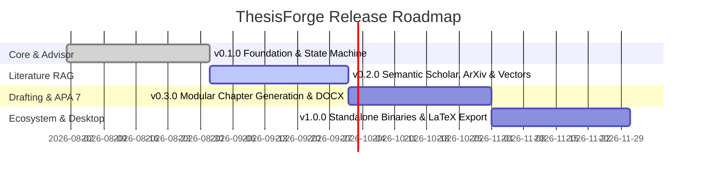

# ThesisForge Roadmap 🗺️

This document outlines the strategic product and engineering roadmap for **ThesisForge**. 

---

## 🎯 Vision Statement

Empower researchers and university students to forge scientifically rigorous, hallucination-free, and ethically sound research projects with structured AI guidance, verified academic literature (RAG), and complete data ownership (BYOK / Local-first).

---

## 📍 Release Roadmap

---

### 🟢 Phase 1: Foundation & Methodological Advisor (v0.1.0) — [Current]
- [x] Modern async architecture with FastAPI, Pydantic v2, and SQLAlchemy 2.0 / aiosqlite.
- [x] State-machine driven Methodological Advisor for problem statement, objectives, and hypotheses.
- [x] Multi-provider BYOK LLM Router (LiteLLM, OpenRouter, Gemini, Groq, Ollama, OpenAI) with retry policies.
- [x] Enterprise AppSec core: SSRF Guard, Fernet local key encryption, and structured logging.
- [x] Hermetic CI/CD test matrix across Python 3.10–3.12 (Ubuntu, Windows).

---

### 🟡 Phase 2: Academic Literature RAG Engine (v0.2.0)
- [ ] Direct async connectors for **Semantic Scholar Graph API**, **ArXiv**, and **CrossRef**.
- [ ] Local vector store integration (ChromaDB / SQLite-vec) for user-uploaded research PDFs.
- [ ] Lexical and semantic contextual chunking (1500 chars, 200 overlap with token rankers).
- [ ] Anti-Hallucination verification gate: automatic DOI/cross-referencing check before citation generation.
- [ ] PubMed and Europe PMC open connector integration.

---

### 🟡 Phase 3: Modular Drafting & APA 7 Formatting (v0.3.0)
- [ ] Hierarchical chapter drafting memory (ensuring Chapter 3 Methodology inherits Chapter 1 Objectives).
- [ ] APA 7th edition DOCX export engine with automatic running head, title page, and table formatting.
- [ ] Formula injection sanitization on all exported tabular data.
- [ ] Real-time token streaming via WebSockets with `aria-live` accessible UI components.
- [ ] Interactive Web UI with Tailwind CSS and Alpine.js.

---

### 🔵 Phase 4: Desktop Distribution & Ecosystem (v1.0.0)
- [ ] PyWebView standalone desktop application packaging (`.exe` for Windows, `.dmg` for macOS, AppImage for Linux).
- [ ] Automated PyPI release (`pip install thesisforge`).
- [ ] LaTeX & Overleaf export engine (`.tex` + `.bib` files).
- [ ] Native Zotero and Mendeley local library sync via SQLite / local APIs.
- [ ] Multilingual methodological interview templates (English, Spanish, Portuguese).

---

## 💡 How to Propose a Roadmap Item

Have an idea for ThesisForge?
- Open a discussion on [GitHub Discussions](https://github.com/oscarbol09/thesisforge/discussions).
- Submit a structured [Feature Request](.github/ISSUE_TEMPLATE/feature_request.yml) or [Academic Source RFC](.github/ISSUE_TEMPLATE/academic_source_rfc.yml).
