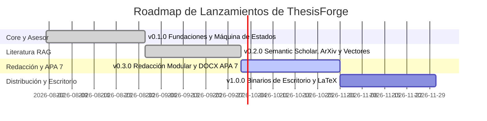

# Roadmap del Proyecto

Este documento describe el plan estratégico de desarrollo técnico y evolución de **ThesisForge**.

---

## Declaración de Visión

Permitir a estudiantes de pregrado, posgrado e investigadores estructurar proyectos de grado rigurosos, libres de alucinaciones y con coherencia metodológica estricta mediante IA explicable, búsqueda indexada de literatura científica real (RAG) y control total de sus datos (BYOK y local-first).

---

## Fases de Lanzamiento

---

### Fase 1: Fundaciones y Asesor Metodológico (v0.1.0) — [Completada]
- [x] Arquitectura asíncrona moderna con FastAPI, Pydantic v2 y SQLAlchemy 2.0 / aiosqlite.
- [x] Asesor Metodológico guiado por máquina de estados determinista para planteamiento del problema, objetivos y consistencia de hipótesis.
- [x] Router LLM multi-proveedor BYOK (LiteLLM, OpenRouter, Gemini, Groq, Ollama, OpenAI, Anthropic) con políticas de reintento.
- [x] Core de seguridad AppSec: SSRF Guard, cifrado local de claves con Fernet y logging estructurado JSON con prevención CWE-117.
- [x] Matriz de pruebas CI/CD hermética en Python 3.10–3.12 (Ubuntu, Windows).

---

### Fase 2: Motor RAG y Búsqueda de Literatura Real (v0.2.0) — [Completada]
- [x] Conectores asíncronos directos para **Semantic Scholar Graph API**, **ArXiv** y **CrossRef**.
- [x] Almacenamiento vectorial local (ChromaDB) para artículos PDF cargados por el usuario.
- [x] Chunking contextual léxico y semántico (1500 caracteres, 200 de solapamiento).
- [x] Compuerta anti-alucinaciones con verificación de DOI antes de sugerir citas y evaluación de evidencia.
- [x] Formateador estricto de citaciones en texto y referencias bajo normas APA 7ª edición.

---

### Fase 3: Redacción Modular y Compilación APA 7 (v0.3.0)
- [ ] Memoria jerárquica contextual por capítulos (garantiza que el Capítulo 3 de Metodología herede los Objetivos del Capítulo 1).
- [ ] Compilador de documentos Word (`.docx`) formateados estrictamente según APA 7 (portada, márgenes de 2.54 cm, sangría francesa y tablas).
- [ ] Sanitización contra inyección de fórmulas en todas las tablas exportadas.
- [ ] Streaming de tokens en tiempo real vía WebSockets.
- [ ] Interfaz web interactiva con Tailwind CSS y Alpine.js.
- [ ] **Manual de Usuario Oficial (v0.3.0):** Guía paso a paso ilustrada para estudiantes e investigadores (desde configuración BYOK y entrevista socrática hasta la exportación final de tesis).

---

### Fase 4: Distribución de Escritorio y Ecosistema (v1.0.0)
- [ ] Empaquetado ejecutable de escritorio standalone con PyWebView (`.exe` para Windows, `.dmg` para macOS, AppImage para Linux).
- [ ] Publicación del paquete en PyPI (`pip install thesisforge`).
- [ ] Motor de exportación a LaTeX / Overleaf (archivos `.tex` y `.bib`).
- [ ] Sincronización local con bibliotecas de Zotero y Mendeley.
- [ ] Manual de Usuario interactivo integrado en la aplicación de escritorio y exportable a PDF.

---

## Cómo Proponer una Funcionalidad

¿Tienes una propuesta o mejora para ThesisForge?
- Inicia una discusión en [GitHub Discussions](https://github.com/oscarbol09/thesisforge/discussions).
- Envía una solicitud estructurada usando las plantillas de incidencias del repositorio.

