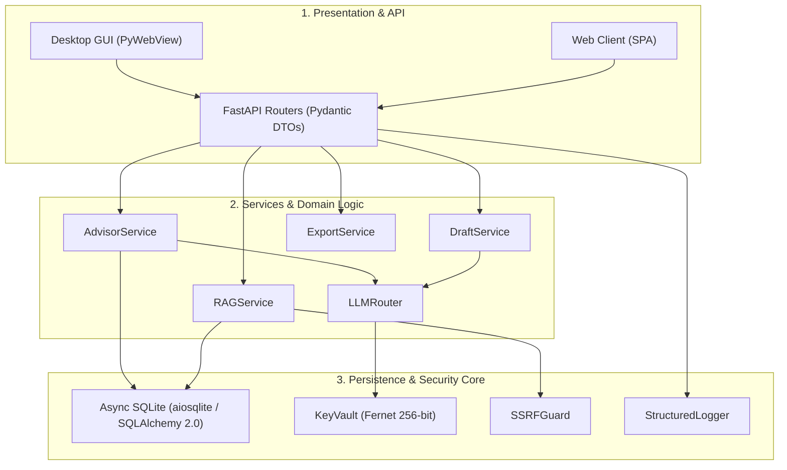

# Arquitectura del Sistema 🏗️

ThesisForge está diseñado bajo principios de software para ingeniería de producción, con separación estricta de responsabilidades, tipado estático riguroso y concurrencia asíncrona no bloqueante.

---

## 🏛️ Patrón Arquitectónico en 3 Capas

---

## 🛡️ Principios de Diseño

1. **Cero Bloqueo de Event Loop:** Todas las operaciones de red (`httpx.AsyncClient`), bases de datos (`aiosqlite`) y archivos (`aiofiles`) son estrictamente no bloqueantes.
2. **Tipado Estático Riguroso:** Verificación con `mypy --strict` en todo el paquete `src/thesisforge`.
3. **Manejo Estructurado de Errores:** Jerarquía de excepciones de dominio tipadas (`ThesisForgeError`, `MethodologyValidationError`, `SecurityError`, etc.) con códigos de error legibles por máquinas.
4. **Fechas UTC:** Manejo exclusivo de fechas y horas conscientes de zona horaria (`datetime.now(timezone.utc)`).
