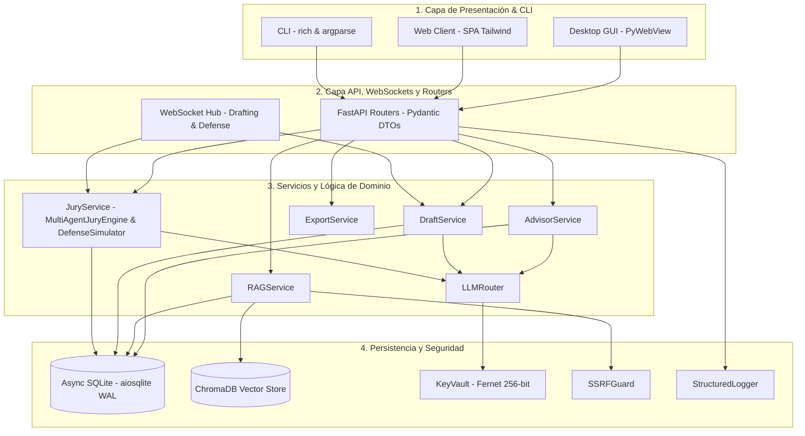

# Arquitectura del Sistema

ThesisForge está diseñado bajo principios de software para ingeniería de producción, con separación estricta de responsabilidades, tipado estático riguroso y concurrencia asíncrona no bloqueante.

---

## Patrón Arquitectónico en 4 Capas

---

## Principios de Diseño

1. **Cero Bloqueo de Event Loop:** Todas las operaciones de red (`httpx.AsyncClient`), bases de datos (`aiosqlite`), archivos (`aiofiles`) y procesamiento pesado de documentos (`asyncio.to_thread`) son estrictamente no bloqueantes.
2. **Tipado Estático Riguroso:** Verificación con `mypy --strict` en todo el paquete `src/thesisforge` (0 errores en 67 archivos fuente).
3. **Autenticación Local-First Universal:** Protección unificada de endpoints HTTP y WebSockets mediante tokens de instancia (`core/auth.py`), cabeceras Bearer y parámetros de consulta para streaming.
4. **Control de Concurrencia Optimista (OCC):** Versionado monotónico en SQLite y cabecera `X-Project-Version` con control de conflictos `HTTP 409`.
5. **Aislamiento y Ciclo de Vida Vectorial:** Limpieza atómica de colecciones ChromaDB al eliminar proyectos y persistencia del estado de indexación en SQLite (`document_index_status`) para reconstrucciones resilientes.
6. **Manejo Estructurado de Errores:** Jerarquía de excepciones de dominio tipadas (`ThesisForgeError`, `MethodologyValidationError`, `JuryEvaluationError`, `DefenseSessionError`, `SecurityError`, `DocumentProcessingError`) con códigos de error legibles por máquinas.
7. **Fechas UTC:** Manejo exclusivo de fechas y horas conscientes de zona horaria (`datetime.now(timezone.utc)`).
8. **Auditoría Científica Híbrida:** Combinación de validación determinista de consistencia epistemológica (reglas duras) con deliberación cualitativa distribuida en tribunal multi-agente.

