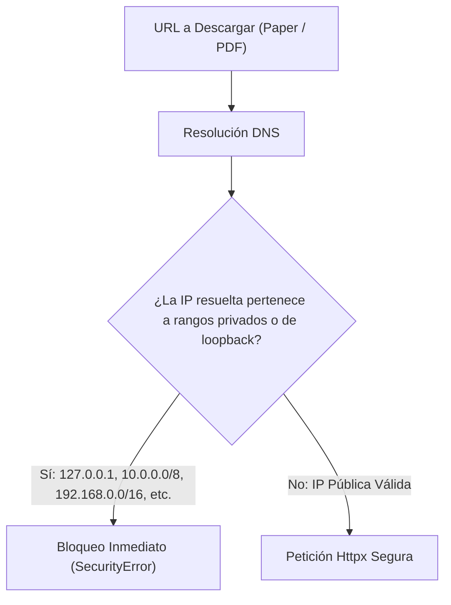

# Seguridad y AppSec en ThesisForge

ThesisForge incorpora mecanismos de defensa en profundidad para proteger al investigador contra riesgos de seguridad comunes en aplicaciones asistidas por IA.

---

## SSRF Guard (Server-Side Request Forgery)

Cuando el sistema descarga artículos científicos de URLs proporcionadas por APIs o el usuario, `SSRFGuard` ejecuta una validación de dos pasos antes de abrir cualquier socket de red:

---

## Key Vault Local

- Las claves de API introducidas por el usuario (OpenRouter, OpenAI, Gemini) se cifran en reposo con **Fernet**.
- Cada registro en la base de datos almacena el vector cifrado junto con su tag de autenticación HMAC.
- Ningún endpoint de la API devuelve las claves en texto plano tras su registro.

---

## Sanitización de Logs (CWE-117)

- `StructuredLogger` procesa todas las cadenas de texto del usuario eliminando secuencias de retorno de carro (`\r`) y salto de línea (`\n`).
- Evita ataques de inyección de logs donde un atacante falsifica entradas de auditoría en los archivos de registro.

---

## Defensa contra Formula Injection (CSV / XLSX / DOCX)

- Si un investigador procesa tablas de datos donde las celdas comienzan con caracteres de fórmula (`=`, `+`, `-`, `@`), ThesisForge prefija automáticamente la celda con un apóstrofe (`'`).
- Esto evita que Microsoft Excel o LibreOffice Calc ejecuten fórmulas maliciosas cuando el usuario abre el archivo exportado.
