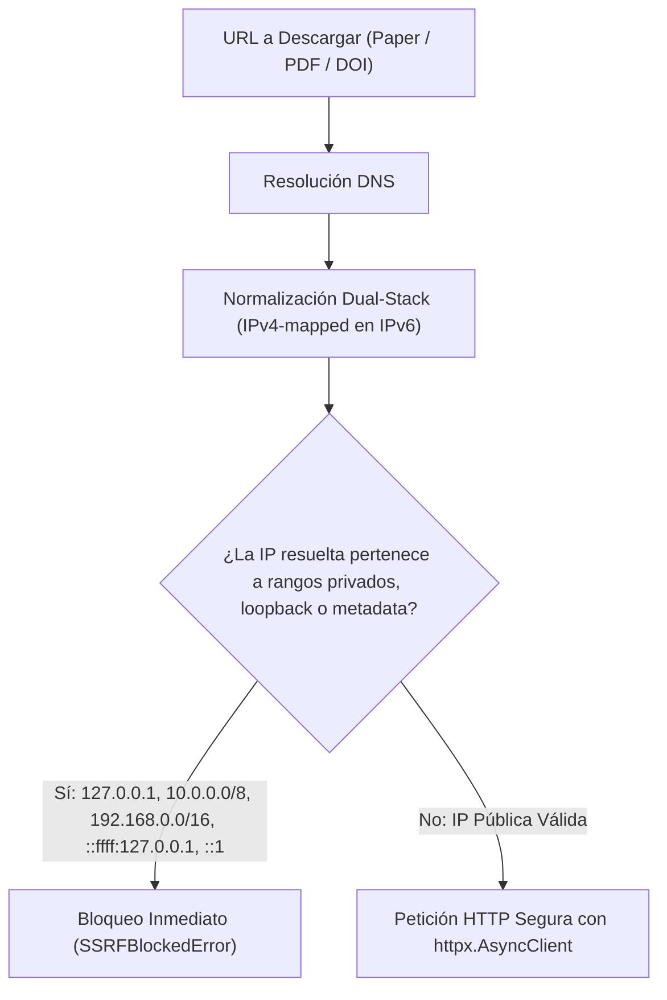

# Seguridad y AppSec en ThesisForge

ThesisForge incorpora mecanismos de defensa en profundidad para proteger al investigador contra riesgos de seguridad comunes en aplicaciones asistidas por IA y herramientas de procesamiento de documentos.

---

## 1. SSRF Guard (Server-Side Request Forgery) y Defensa Dual-Stack

Cuando el sistema descarga artículos científicos o recupera metadatos a partir de URLs suministradas por APIs o por el usuario, `SSRFGuard` (`src/thesisforge/core/security.py`) ejecuta una validación de dos pasos antes de abrir cualquier socket de red:

### Reglas de Bloqueo de Red:
- **Rangos IPv4 privados (RFC 1918)**: `10.0.0.0/8`, `172.16.0.0/12`, `192.168.0.0/16`.
- **Direcciones Loopback**: `127.0.0.0/8` y `::1/128`.
- **Direcciones de enlace local (Link-Local / RFC 3927)**: `169.254.0.0/16` (usadas frecuentemente para atacar endpoints de metadatos en AWS/GCP/Azure como `169.254.169.254`).
- **Direcciones IPv4 mapeadas en IPv6**: Prefijos `::ffff:0:0/96` que representan direcciones IPv4 dentro de una estructura IPv6 (`ip.ipv4_mapped`).
- **Esquemas no permitidos**: Bloqueo absoluto de esquemas locales (`file://`, `gopher://`, `ftp://`), admitiendo únicamente `http://` y `https://`.

---

## 2. Bóveda Criptográfica Local (KeyVault)

ThesisForge sigue una filosofía estricta de **Bring Your Own Key (BYOK)** y almacenamiento seguro en reposo:

- **Cifrado Simétrico Fernet:** AES-128-CBC autenticado mediante HMAC-SHA256 (`src/thesisforge/core/security.py`).
- **Derivación de Clave (KDF):** Derivación robusta basada en PBKDF2-HMAC-SHA256 con 100,000 iteraciones y sal criptográfica única.
- **Aislamiento de Secretos:** Las claves privadas nunca se devuelven en texto plano a través de la API REST tras su registro y se almacenan únicamente en la base de datos local SQLite del usuario.

---

## 3. Sanitización de Logs (CWE-117)

El registrador estructurado `StructuredLogger` (`src/thesisforge/core/logging.py`) emite eventos en formato JSON y neutraliza cualquier intento de manipulación de bitácoras:

- **Eliminación de saltos de línea:** Reemplaza caracteres de retorno de carro (`\r`) y salto de línea (`\n`) en todas las cadenas proporcionadas por el usuario.
- **Enmascaramiento de Secretos:** Ofuscación automática de tokens, claves de API (`sk-or-v1-...`, `AIzaSy...`) y encabezados de autorización en las trazas de depuración.

---

## 4. Defensa contra Formula Injection en Tablas (CWE-1236)

Al compilar documentos a Microsoft Word (`.docx`) u hojas de cálculo con datos de investigación:

- `sanitize_cell_value` (`src/thesisforge/drafting/sanitizer.py`) depura primero los caracteres de control (`\r`, `\n`, `\t`).
- Si una celda comienza con caracteres ejecutables (`=`, `+`, `-`, `@`, `|`), el sistema antepone un apóstrofe de escape (`'`).
- Preserva de forma transparente literales numéricos legítimos (por ejemplo, `-15.4` o `+3.2`) sin corromper el análisis estadístico ni las tablas del marco empírico.
