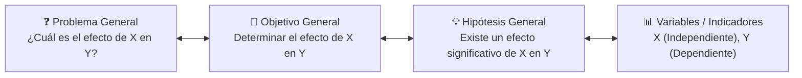

# Guía del Asesor Metodológico 🧭

El **Asesor Metodológico** de ThesisForge actúa como un tutor de tesis virtual basado en una máquina de estados determinista. Su objetivo es garantizar la coherencia interna de tu investigación antes de escribir una sola línea de borrador.

---

## 📐 Matriz de Consistencia Metodológica

ThesisForge evalúa de manera continua la alineación entre:

---

## 🏛️ Taxonomía de Objetivos (Bloom)

El validador léxico (`AdvisorValidators`) analiza que los objetivos de investigación utilicen verbos en infinitivo clasificados según el nivel de profundidad de la investigación:

| Nivel de Investigación | Verbos Permitidos | Propósito |
|:-----------------------|:------------------|:----------|
| **Exploratorio** | Identificar, Explorar, Describir, Reconocer | Primer acercamiento a fenómenos poco estudiados. |
| **Descriptivo** | Caracterizar, Clasificar, Cuantificar, Detallar | Medir y especificar propiedades de variables. |
| **Correlacional** | Relacionar, Asociar, Vincular, Correlacionar | Evaluar el grado de relación entre dos o más variables. |
| **Explicativo / Causal**| Demostrar, Determinar, Evaluar, Comprobar | Establecer relaciones de causa y efecto. |

---

## 🔄 Fases de la Entrevista

1. **Delimitación Temática y Línea de Investigación:** Delimita el campo de estudio y la población objetivo.
2. **Planteamiento del Problema:** Formula la pregunta general y específicas según el método sintomático-causal.
3. **Objetivos de Investigación:** Formula el objetivo general y los objetivos específicos derivados.
4. **Hipótesis y Operacionalización de Variables:** Define dimensiones, indicadores e instrumentos de medición.
5. **Aprobación de la Ficha Metodológica:** Sella la estructura lógica para que los generadores de borradores nunca pierdan el rumbo.
