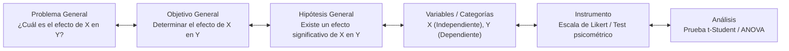

# Guía del Asesor Metodológico

El **Asesor Metodológico** de ThesisForge actúa como un tutor de tesis virtual basado en una máquina de estados finitos determinista (`AdvisorStateMachine`). Su objetivo es garantizar la coherencia interna de tu investigación antes de redactar una sola línea de borrador capitular.

---

## 1. Matriz de Consistencia Metodológica

ThesisForge evalúa de manera continua la alineación epistemológica y lógica entre los componentes del proyecto a través del `ConsistencyMatrixEngine` (`src/thesisforge/advisor/consistency_matrix.py`).

El motor construye una **matriz de 6 pilares** que verifica la coherencia columna a columna para cada pregunta/objetivo específico:

| Pilar | Campo evaluado | Descripción |
| :--- | :--- | :--- |
| **1. Pregunta Específica** | `research_question` + derivadas | Delimita el fenómeno observado |
| **2. Objetivo Específico** | `specific_objectives[]` | Debe reflejar la pregunta punto a punto |
| **3. Hipótesis** | `hypothesis` (si aplica) | Obligatoria en diseños correlacionales/causales |
| **4. Variables (VI / VD / Control)** | `operationalized_variables[]` | Con escala de medición declarada |
| **5. Instrumento** | `methodology.instruments[]` | Ligado a la escala de la variable |
| **6. Análisis / Prueba Estadística** | `methodology.analysis_technique` | Compatible con la escala (ver tabla de compatibilidad) |

### Compatibilidad de Escala con Prueba Estadística

El motor verifica automáticamente que la técnica de análisis sea compatible con la escala de medición de las variables operacionalizadas:

| Escala | Pruebas compatibles |
| :--- | :--- |
| **Nominal** | Chi-cuadrado, Fisher, Regresión logística |
| **Ordinal** | Spearman, Mann-Whitney, Wilcoxon, Kruskal-Wallis, Kendall |
| **Intervalo / Razón** | Pearson, t-Student, ANOVA, ANCOVA, SEM, Regresión lineal |

Si hay incompatibilidad (p. ej., usar ANOVA con variables nominales), el sistema emite un issue de alineación con nota explicativa.

### Amenazas a la Validez Auditadas

Además de la alineación, el engine audita cuatro dominios de validez científica:

| Dominio | Amenaza detectada | Condición de disparo |
| :--- | :--- | :--- |
| **Interna** | Mortalidad experimental / Atrición | Diseño longitudinal declarado |
| **Externa** | Sesgo de muestreo no probabilístico | Técnica de muestreo no probabilística |
| **Constructo** | Sub-representación del constructo | Variable con < 2 indicadores |
| **Estadística** | Incompatibilidad de escala con prueba | Ver tabla anterior |

### Acceso vía API REST

```bash
# Obtener la matriz de consistencia de un proyecto
GET /api/advisor/{project_id}/consistency-matrix
```

La respuesta incluye las filas de la matriz en JSON y la tabla renderizada en Markdown (campo `markdown_table`), lista para insertar en cualquier informe.

### Vista simplificada (diagrama de coherencia central)



---

## 2. Enfoques de Investigación Soportados

El asesor adapta automáticamente sus reglas de validación y la estructura de los capítulos según el enfoque seleccionado:

| Enfoque (`ResearchApproach`) | Requisitos de Hipótesis | Operacionalización Requerida | Estructura de Capítulos |
| :--- | :--- | :--- | :--- |
| **Cuantitativo (`CUANTITATIVO`)** | Hipótesis general y derivadas **obligatorias** para diseños correlacionales, explicativos o experimentales. | Variables independientes y dependientes con dimensiones, indicadores e instrumentos cuantitativos. | 5 Capítulos estándar con pruebas estadísticas e inferenciales. |
| **Cualitativo (`CUALITATIVO`)** | Supuestos teóricos / preguntas directrices (no requiere hipótesis numéricas contrastables). | Categorías y subcategorías de análisis, matrices de triangulación y guías de entrevista/observación. | 5 Capítulos con análisis temático, fenomenológico o fundamentado. |
| **Mixto (`MIXTO`)** | Hipótesis cuantitativas complementadas con preguntas cualitativas de profundización. | Variables cuantitativas y categorías cualitativas integradas con diseño de triangulación concurrente (DITRIAC) o secuencial. | 5 Capítulos con integración de hallazgos mixtos. |

---

## 3. Taxonomía de Objetivos (Bloom)

El validador léxico (`AdvisorValidators` en `src/thesisforge/advisor/validators.py`) analiza que los objetivos de investigación utilicen verbos en infinitivo clasificados según el nivel de profundidad de la investigación:

| Nivel de Investigación | Verbos Permitidos | Propósito Epistemológico |
| :--- | :--- | :--- |
| **Exploratorio** | Identificar, Explorar, Describir, Reconocer, Indagar | Primer acercamiento a fenómenos poco estudiados o emergentes. |
| **Descriptivo** | Caracterizar, Clasificar, Cuantificar, Detallar, Medir | Especificar propiedades, perfiles y frecuencias de variables. |
| **Correlacional** | Relacionar, Asociar, Vincular, Correlacionar, Comparar | Evaluar el grado de relación o asociación entre dos o más variables. |
| **Explicativo / Causal** | Demostrar, Determinar, Evaluar, Comprobar, Explicar | Establecer relaciones de causa y efecto e inferencias explicativas. |

---

## 4. Fases de la Entrevista Metodológica

1. **Delimitación Temática y Línea de Investigación:** Delimita el campo de estudio, el contexto geográfico-institucional y la población objetivo.
2. **Planteamiento del Problema:** Formula la pregunta general rectora y las preguntas secundarias derivadas según el método sintomático-causal.
3. **Objetivos de Investigación:** Formula el objetivo general y los objetivos específicos alineados punto por punto con las preguntas.
4. **Hipótesis y Operacionalización:** Define hipótesis generales y secundarias (enfoques cuantitativos/mixtos) o supuestos rectores (cualitativos), junto con variables o categorías con al menos 3 caracteres significativos.
5. **Aprobación de la Ficha Metodológica:** Sella la estructura lógica del proyecto en la base de datos para que los generadores de borradores y el jurado evalúen el trabajo con contexto inmutable.
