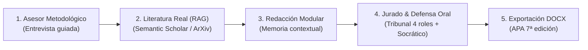

# ThesisForge

Asistente y forjador de proyectos de investigación académica con inteligencia artificial, búsqueda de literatura real indexada (RAG) y redacción modular por capítulos bajo normas APA 7ª edición.

---

## Qué es ThesisForge

ThesisForge es una herramienta de ingeniería académica diseñada para abordar tres limitaciones críticas del uso de LLMs en investigación:

1. **Formulación metodológica guiada:** Estructuración de preguntas de investigación, hipótesis contrastables y taxonomía de objetivos (Bloom) mediante una máquina de estados finita.
2. **Literatura científica verificada (Anti-Alucinaciones):** Recuperación aumentada (RAG) contra fuentes indexadas (Semantic Scholar, ArXiv, CrossRef) y extracción de documentos PDF locales.
3. **Coherencia inter-capítulo:** Memoria contextual jerárquica que asegura que el marco teórico, el diseño metodológico y las conclusiones mantengan alineación estricta con el problema formulado.

---

## Características Principales

- **Control total de claves (BYOK):** Compatible con OpenRouter, Google Gemini, Groq, OpenAI y modelos locales vía Ollama.
- **Seguridad en reposo y de red:** Cifrado simétrico de claves mediante Fernet (256-bit), protección contra Server-Side Request Forgery (SSRF) con bloqueo estricto de rangos privados y sanitización CWE-117.
- **Distribución dual:** Servidor web asíncrono con FastAPI y empaquetado de escritorio local (PyWebView).
- **Tribunal Multi-Agente & Defensa Socrática:** 4 perfiles de jurado académico con auditoría híbrida (reglas + LLM) y réplicas interactivas por WebSockets.
- **Exportación estructurada en Word:** Generación directa de archivos `.docx` formateados con normas APA 7ª edición (portada, márgenes de 2.54 cm, sangría francesa y DOIs activos).

---

## Estructura de la Documentación

- [**Instalación**](getting-started/installation.md): Guía de configuración con `uv`, `pip`, binarios standalone o Docker.
- [**Inicio Rápido**](getting-started/quickstart.md): Configuración del primer proyecto en 5 minutos.
- [**Asesor Metodológico**](guides/methodology.md): Arquitectura de la máquina de estados y validaciones taxonómicas.
- [**RAG & Literatura Real**](guides/rag-literature.md): Conectores académicos y búsqueda vectorial local.
- [**Configuración BYOK**](guides/byok-and-models.md): Integración de proveedores remotos y ejecución offline con Ollama.
- [**Exportación APA 7**](guides/apa7-export.md): Normas tipográficas, jerarquía de títulos y referencias.
- [**Tribunal Multi-Agente & Defensa**](guides/jury-and-defense.md): Auditoría del tribunal y simulador socrático.
- [**Arquitectura del Sistema**](architecture/overview.md): Patrón en capas, invariantes de seguridad y concurrencia.

