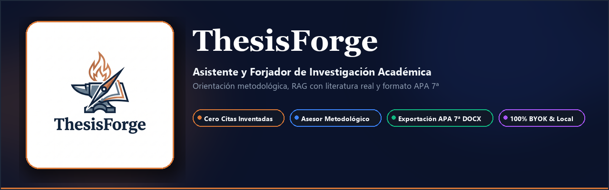
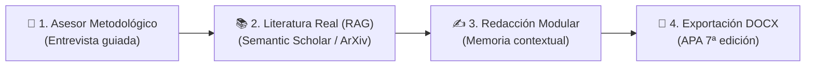

  

# 🔨 ThesisForge

> **Asistente y forjador de proyectos de investigación académica con IA, RAG y BYOK.**  
> Diseñado para guiar al estudiante de pregrado y posgrado paso a paso en la formulación metodológica, búsqueda de literatura real indexada y redacción modular de capítulos con formato APA 7ª edición.

---

## 🎯 ¿Qué es ThesisForge?

ThesisForge es una plataforma de investigación asistida por inteligencia artificial diseñada para eliminar los tres problemas más graves del uso de LLMs en el ámbito académico:

1. **Enfoque Metodológico Débil:** Guiar mediante una entrevista interactiva estructurada para definir problemas, objetivos alineados a la taxonomía de Bloom, hipótesis y variables.
2. **Cero Citas Inventadas (Anti-Alucinaciones):** Integración directa con Semantic Scholar, ArXiv, CrossRef y búsqueda vectorial local en PDFs subidos por el usuario.
3. **Inconsistencia entre Capítulos:** Generación modular con memoria jerárquica contextual, asegurando que la metodología responda estrictamente al problema planteado.

---

## 🚀 Características Principales

- 🔑 **100% BYOK (Bring Your Own Key):** Usa tus propias claves o modelos locales (OpenRouter, Gemini, Ollama, Groq, OpenAI).
- 🛡️ **Seguridad Empresarial:** Bóveda local cifrada con Fernet (256-bit), protección contra SSRF con filtrado de rangos privados y sanitización de inyecciones.
- 🖥️ **Doble Distribución:** Ejecutable standalone de escritorio (PyWebView) o servidor web asíncrono (FastAPI).
- 📄 **Exportación APA 7:** Generación directa de archivos `.docx` listos para entrega con citas parentéticas y referencias estructuradas.

---

## 📚 Estructura de la Documentación

- [**Instalación**](getting-started/installation.md): Guía de instalación con `uv`, `pip`, binarios de escritorio o Docker.
- [**Guía Metodológica**](guides/methodology.md): Cómo funciona la máquina de estados del Asesor Metodológico.
- [**Configuración BYOK**](guides/byok-and-models.md): Cómo configurar proveedores LLM remotos o modelos locales vía Ollama.
- [**Arquitectura**](architecture/overview.md): Diseño técnico en 3 capas y principios de ingeniería.
