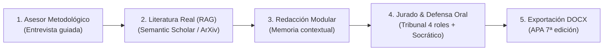

# ThesisForge

Asistente y forjador de proyectos de investigación académica con inteligencia artificial, búsqueda de literatura real indexada (RAG) y redacción modular por capítulos bajo normas APA 7ª edición.

---

## Qué es ThesisForge

ThesisForge es una herramienta de ingeniería académica diseñada para abordar tres limitaciones críticas del uso de LLMs en investigación:

1. **Formulación metodológica guiada:** Estructuración de preguntas de investigación, hipótesis contrastables y taxonomía de objetivos (Bloom) mediante una máquina de estados finita.
2. **Literatura científica verificada (Anti-Alucinaciones):** Recuperación aumentada (RAG) contra fuentes indexadas (Semantic Scholar, ArXiv, CrossRef) y extracción de documentos PDF locales.
3. **Coherencia inter-capítulo:** Memoria contextual jerárquica que asegura que el marco teórico, el diseño metodológico y las conclusiones mantengan alineación estricta con el problema formulado.

```mermaid
graph LR
    A["1. Asesor Metodológico\n(Entrevista guiada)"] --> B["2. Literatura Real (RAG)\n(Semantic Scholar / ArXiv)"]
    B --> C["3. Redacción Modular\n(Memoria contextual)"]
    C --> D["4. Jurado & Defensa Oral\n(Tribunal 4 roles + Socrático)"]
    D --> E["5. Exportación DOCX\n(APA 7ª edición)"]
```

---

## Características Principales

- **Tratado Integral de Metodología Científica:** Arquitectura de 8 movimientos del problema, reporte estadístico APA 7 en 4 componentes ($M/DT$, estadístico con $gl$, $p$-exacto, tamaño de efecto con IC 95%), análisis cualitativo en 4 movimientos con casos discrepantes, triangulación en 3 movimientos, conclusiones isomórficas ($N=N$) y recomendaciones en 4 componentes por destinatario explícito.
- **Control total de claves (BYOK) y Catálogo Curado:** Compatible con OpenRouter, Google Gemini, Anthropic, OpenAI, Groq y modelos locales vía Ollama, clasificados en opciones *Free Tier* y *Tier Superior* con prueba de latencia y conexión en tiempo real.
- **Auditoría Anti-Slop y Detox de Redacción:** Detección de clichés sintéticos de IA, variabilidad de ritmo sintáctico, anclaje de citas L3 con localizador de página/párrafo, eliminación de inflación inferencial (*"altamente significativo"*), mitigación de concepciones erróneas frecuentistas y bloqueo de recomendaciones vacuas.
- **Seguridad en reposo y de red:** Cifrado simétrico de claves mediante Fernet (AES-128-CBC + HMAC-SHA256), protección contra Server-Side Request Forgery (SSRF) con bloqueo estricto de rangos privados, neutralización de inyección de fórmulas (CWE-1236) y sanitización de logs CWE-117.
- **Distribución dual:** Servidor web asíncrono con FastAPI y SPA moderna (Tailwind CSS + Alpine.js) junto a un lanzador de escritorio nativo con PyWebView.
- **Tribunal Multi-Agente & Defensa Socrática:** 4 perfiles de jurado académico con auditoría híbrida (20 errores metodológicos fatales + compuerta de 7 modos de fallo de IA) y réplicas interactivas por WebSockets.
- **Exportación estructurada en Word:** Generación directa de archivos `.docx` formateados con normas APA 7ª edición (portada, márgenes de 2.54 cm, sangría francesa, índice dinámico TOC y referencias desduplicadas).

---

## Estructura de la Documentación

- [**Instalación**](getting-started/installation.md): Guía de configuración con `uv`, `pip`, binarios standalone o Docker.
- [**Inicio Rápido**](getting-started/quickstart.md): Configuración del primer proyecto en 5 minutos.
- [**Interfaz SPA & Escritorio**](guides/desktop-and-gui.md): Experiencia gráfica interactiva con Tailwind CSS y lanzador PyWebView.
- [**Asesor Metodológico**](guides/methodology.md): Arquitectura de la máquina de estados y validaciones taxonómicas.
- [**RAG & Literatura Real**](guides/rag-literature.md): Conectores académicos y búsqueda vectorial local.
- [**Configuración BYOK**](guides/byok-and-models.md): Integración de proveedores remotos y ejecución offline con Ollama.
- [**Exportación APA 7**](guides/apa7-export.md): Normas tipográficas, jerarquía de títulos y referencias.
- [**Tribunal Multi-Agente & Defensa**](guides/jury-and-defense.md): Auditoría del tribunal y simulador socrático.
- [**Arquitectura del Sistema**](architecture/overview.md): Patrón en capas, invariantes de seguridad y concurrencia.

