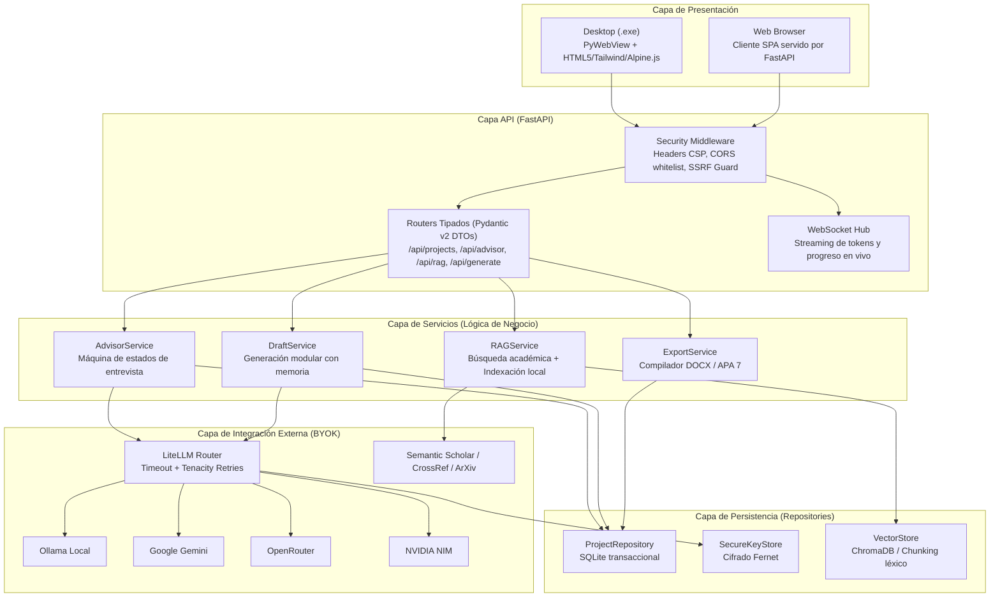

# 🔨 ThesisForge — Asistente y Forjador de Investigación Académica con IA

Plan de desarrollo para un sistema que guía al estudiante paso a paso en la elaboración de proyectos de investigación (pregrado y posgrado), con búsqueda de literatura real (RAG), generación modular de borradores, soporte BYOK multi-proveedor y arquitectura de nivel Staff/Senior alineada con los estándares de ingeniería más rigurosos.

---

## 1. Visión General del Producto

### 1.1 Problema que Resuelve

Los estudiantes de pregrado y posgrado enfrentan tres fricciones críticas al elaborar sus proyectos de investigación:

```text
1. Enfoque metodológico débil:
   └── Dificultad para formular preguntas de investigación formales, hipótesis y
       objetivos delimitados que respeten la taxonomía científica.

2. Referencias inventadas por la IA (Alucinaciones):
   └── Los LLMs generan citas y DOIs inexistentes, destruyendo el rigor
       académico del trabajo.

3. Inconsistencia entre capítulos:
   └── Generar documentos extensos en un solo prompt degrada el contexto: la
       metodología no responde al problema y las conclusiones se desconectan de los datos.
```

### 1.2 Solución: ThesisForge

**ThesisForge** forja el proyecto de investigación a través de un flujo estructurado en tres fases: **Orientación Metodológica $\rightarrow$ Contextualización (RAG) $\rightarrow$ Redacción Modular por Capítulos**, asegurando coherencia cruzada y respaldo bibliográfico verificado.

### 1.3 Características Clave

- 🧭 **Asesor Metodológico Interactivo** — Entrevista guiada que valida el problema, hipótesis y objetivos antes de redactar.
- 📚 **RAG con Literatura Real** — Búsqueda en Semantic Scholar, ArXiv y CrossRef + indexación de PDFs con ChromaDB y chunking léxico.
- ✍️ **Redacción por Capítulos (Chunking Contextual)** — Generación secuencial donde cada sección hereda la ficha metodológica y resúmenes de secciones previas.
- 🔑 **BYOK (Bring Your Own Key/Model)** — Soporte para OpenRouter, Gemini, NVIDIA NIM, Groq, Ollama y endpoints OpenAI-compatible con claves cifradas localmente.
- 🖥️ **Doble Distribución** — Aplicación de escritorio (`.exe` con PyWebView) + servidor web (FastAPI) desde el mismo código base.
- 📄 **Exportación Profesional** — Documentos Word (`.docx`) con formato APA 7ª edición, tabla de contenidos y referencias estructuradas.

### 1.4 Tu Portafolio como Base de Código

> [!TIP]
> El proyecto reutiliza patrones y código de tus proyectos previos ([EduRag](https://github.com/oscarbol09/EduRag) y [AudioBard](https://github.com/oscarbol09/audiobard)), acelerando el desarrollo:

| Componente | Proyecto Base | Patrón / Código Reutilizable |
|---|---|---|
| **BYOK Multi-Proveedor** | AudioBard | Patrón de abstracción LLM pluggable, Pydantic Settings + YAML config. |
| **Context Builder (RAG)** | EduRag | `context_builder.py` — chunking léxico (1500 chars, overlap 200, ranking por tokens). |
| **Procesador de Documentos** | EduRag | `document_content_store.py` — extracción de texto de PDF, DOCX, TXT, MD. |
| **Cifrado de API Keys** | EduRag | `security_utils.py` con Fernet para guardar claves en SQLite de forma segura. |
| **Testing & CI/CD** | AudioBard | `pytest` + `pytest-asyncio` + `respx` + `ruff` + `mypy --strict` + GitHub Actions. |
| **GUI & Desacoplamiento** | AudioBard | Separación limpia entre lógica de negocio y capa de presentación. |

---

## 2. Principios de Ingeniería & Negative Constraints (Finish Gates)

Para erradicar vicios de código generados por IA y garantizar un estándar de producción senior, el proyecto se rige por las siguientes restricciones estrictas:

### 2.1 Backend & Concurrencia (Python)
- **PROHIBIDO:** Bloquear el event loop en `async def` con `requests.get()`, `time.sleep()`, o I/O síncrono. Utilizar exclusivamente `httpx.AsyncClient`, `asyncio.sleep()`, y `aiofiles`.
- **PROHIBIDO:** Compartir una sola sesión `AsyncSession` entre corrutinas en `asyncio.gather()`. Cada tarea debe solicitar su propia sesión del pool.
- **PROHIBIDO:** Timestamps ingenuos (`datetime.now()`). Usar estrictamente `datetime.now(timezone.utc)`.
- **PROHIBIDO:** Flotantes para dinero o conteos críticos. Usar `Decimal` o enteros.
- **PROHIBIDO:** Capturas silenciosas de errores (`except Exception: pass`). Utilizar excepciones de dominio tipadas y registro estructurado (`logger.exception`).
- **OBLIGATORIO:** Arquitectura en 3 capas unidireccionales: **Routers (DTOs/HTTP)** $\rightarrow$ **Services (Dominio/Lógica)** $\rightarrow$ **Repositories (Persistencia)**.

### 2.2 Seguridad & AppSec
- **PROHIBIDO:** SSRF en peticiones salientes. Toda URL introducida para descargar papers o PDFs debe resolver DNS y bloquear rangos privados/locales (`127.0.0.0/8`, `10.0.0.0/8`, `172.16.0.0/12`, `192.168.0.0/16`, `169.254.169.254`, `::1/128`).
- **PROHIBIDO:** Concatenar strings en SQL o comandos de sistema. Usar sentencias parametrizadas y `subprocess.run(..., shell=False)` con arrays de argumentos.
- **PROHIBIDO:** Inyectar HTML generado por el LLM directamente en el DOM sin sanitización previa con `DOMPurify`.
- **PROHIBIDO:** Formula Injection en exportación de tablas. Prefijar cualquier celda de texto que comience con `=`, `+`, `-`, `@`, `\t`, o `\r` con un apóstrofe (`'`).
- **PROHIBIDO:** Log injection (CWE-117). Sanitizar saltos de línea (`\r`, `\n`) y redactar claves/tokens en logs estructurados.

### 2.3 Frontend Craftsmanship & Accesibilidad
- **PROHIBIDO:** Estética "AI-Slop" genérica: fondos oscuros con orbes púrpuras difusos, botones con radios gigantes tipo píldora (`rounded-2xl`/`rounded-full`), y exceso de iconos decorativos en botones con texto claro.
- **OBLIGATORIO:** Regla 60-30-10: 60% lienzo neutro (Zinc/Stone), 30% superficies estructurales, 10% acento intencional (ej. Cobalt `#2563eb` o Emerald `#059669`).
- **OBLIGATORIO:** Radios arquitectónicos sobrios: `rounded-md` (6px) o `rounded-lg` (8px).
- **OBLIGATORIO:** Micro-interacciones rápidas (150ms–220ms) con curvas de desaceleración (`cubic-bezier(0.16, 1, 0.3, 1)`) y feedback táctil (`active:scale-[0.98]`).
- **OBLIGATORIO:** Cobertura de los **6 estados de UI**: Ideal, Vacío (con CTA), Cargando (esqueleto con dimensiones exactas para 0 Cumulative Layout Shift), Error (con reintento), Parcial/Borde, y Optimista.
- **OBLIGATORIO:** Accesibilidad WCAG 2.2 AA: Contraste $\ge 4.5:1$, anillos `:focus-visible:ring-2`, navegación por teclado completa, focus traps en modales, y regiones `aria-live="polite"` para la generación de texto en tiempo real.

### 2.4 QA & Testing
- **PROHIBIDO:** Mocks tautológicos (`mock.call.return_value = X; assert service() == X`).
- **PROHIBIDO:** Herencia de `unittest.TestCase` y `time.sleep()`.
- **OBLIGATORIO:** Suites puras en `pytest` con fixtures transaccionales herméticas (`session.rollback()`), intercepción a nivel de transporte con `respx`, tests parametrizados con `ids` legibles, y pruebas basadas en propiedades con `Hypothesis` para parsers y formateadores.

---

## 3. Arquitectura del Sistema



---

## 4. Estructura del Repositorio

```text
thesisforge/
├── pyproject.toml                      # Metadata, dependencias y scripts
├── README.md
├── LICENSE
├── .env.example                        # Variables de entorno modelo
├── config.yaml.example                 # Configuración de proveedores BYOK
├── Dockerfile                          # Build para despliegue web
│
├── src/thesisforge/                    # Paquete Python principal
│   ├── __init__.py
│   ├── config.py                       # [Pydantic Settings] Configuración central
│   ├── models.py                       # [Pydantic v2] DTOs y esquemas de dominio
│   ├── exceptions.py                   # Jerarquía de excepciones de dominio
│   │
│   ├── core/                           # Utilidades de bajo nivel y seguridad
│   │   ├── __init__.py
│   │   ├── security.py                 # Cifrado Fernet, sanitización SSRF
│   │   ├── logging.py                  # Logger estructurado JSON + sanitización CWE-117
│   │   └── time.py                     # Helpers UTC estricto
│   │
│   ├── repository/                     # Capa de Acceso a Datos
│   │   ├── __init__.py
│   │   ├── database.py                 # Conexión SQLite / engine singleton
│   │   ├── project_repository.py       # CRUD transaccional de proyectos
│   │   └── keystore_repository.py      # Almacén seguro de API keys
│   │
│   ├── llm/                            # Abstracción BYOK
│   │   ├── __init__.py
│   │   ├── router.py                   # LiteLLM client con retries Tenacity
│   │   └── prompts.py                  # Plantillas de prompt versionadas
│   │
│   ├── advisor/                        # Fase 1: Asesor Metodológico
│   │   ├── __init__.py
│   │   ├── service.py                  # Lógica del asesor y máquina de estados
│   │   ├── state_machine.py            # Definición de transiciones y pasos
│   │   └── validators.py              # Validación de consistencia metodológica
│   │
│   ├── rag/                            # Fase 2: Motor RAG Académico
│   │   ├── __init__.py
│   │   ├── service.py                  # Orquestador RAG
│   │   ├── academic_search.py          # Clientes Semantic Scholar, ArXiv, CrossRef
│   │   ├── pdf_processor.py            # PyMuPDF + chunking léxico
│   │   ├── vectorstore.py             # ChromaDB adapter
│   │   └── citation_formatter.py      # Formateador APA 7 / BibTeX
│   │
│   ├── generator/                      # Fase 3: Generador Modular
│   │   ├── __init__.py
│   │   ├── service.py                  # Orquestador de redacción por capítulos
│   │   ├── context_builder.py         # Memoria acumulativa y resúmenes
│   │   └── sections.py                 # Definición de capítulos y rúbricas
│   │
│   ├── export/                         # Módulo de Exportación
│   │   ├── __init__.py
│   │   ├── docx_exporter.py           # Compilador Word (python-docx, APA 7)
│   │   └── formula_sanitizer.py       # Neutralizador de Formula Injection
│   │
│   ├── api/                            # Capa de Entrega HTTP (FastAPI)
│   │   ├── __init__.py
│   │   ├── app.py                      # FastAPI factory + middleware
│   │   ├── deps.py                     # Inyección de dependencias
│   │   ├── routes_project.py          # /api/projects
│   │   ├── routes_advisor.py          # /api/advisor
│   │   ├── routes_rag.py             # /api/rag
│   │   ├── routes_generator.py       # /api/generate
│   │   └── websocket.py              # /api/ws/progress
│   │
│   └── desktop/                        # Lanzador PyWebView
│       ├── __init__.py
│       └── launcher.py                # Wrapper PyWebView + FastAPI embebido
│
├── gui/                                # Frontend SPA (HTML5 + Tailwind + Alpine.js)
│   ├── index.html                      # Layout principal y montura
│   ├── css/
│   │   ├── tokens.css                  # Variables semánticas CSS
│   │   └── typography.css              # Fuentes editoriales + tabular-nums
│   ├── js/
│   │   ├── app.js                      # Inicialización Alpine.js
│   │   ├── advisor.js                  # Componente de entrevista
│   │   ├── rag.js                     # Componente de búsqueda y PDFs
│   │   ├── generator.js              # Componente de redacción por bloques
│   │   └── settings.js               # Modal BYOK de configuración
│   └── components/                    # Plantillas modulares
│       ├── header.html
│       ├── sidebar.html
│       ├── methodology-card.html
│       └── skeleton-loader.html
│
├── tests/                              # Suite de Pruebas
│   ├── conftest.py                     # Fixtures SQLite en memoria y mocks
│   ├── unit/
│   │   ├── test_config.py
│   │   ├── test_models.py
│   │   ├── test_security.py
│   │   ├── test_citation_formatter.py
│   │   └── test_context_builder.py
│   ├── integration/
│   │   ├── test_advisor_flow.py
│   │   ├── test_rag_service.py
│   │   └── test_api_routes.py
│   └── property/
│       ├── test_sanitization_properties.py
│       └── test_apa_formatting_properties.py
│
├── tools/                              # Scripts de soporte
│   └── build_exe.py                   # Empaquetador PyInstaller
│
└── .github/workflows/                  # CI/CD Industrial
    └── ci.yml                          # 3-Gate Pipeline
```

---

## 5. Modelos de Datos de Dominio (Pydantic v2)

```python
# src/thesisforge/models.py
from datetime import datetime, timezone
from enum import Enum
from pydantic import BaseModel, ConfigDict, Field, field_validator
import uuid

def utc_now() -> datetime:
    return datetime.now(timezone.utc)

class AcademicLevel(str, Enum):
    PREGRADO = "pregrado"
    MAESTRIA = "maestria"
    DOCTORADO = "doctorado"

class ResearchApproach(str, Enum):
    CUANTITATIVO = "cuantitativo"
    CUALITATIVO = "cualitativo"
    MIXTO = "mixto"

class ProjectPhase(str, Enum):
    SETUP = "setup"
    ORIENTATION = "orientation"
    CONTEXT = "context"
    DRAFTING = "drafting"
    REVIEW = "review"
    COMPLETED = "completed"

class SectionStatus(str, Enum):
    PENDING = "pending"
    IN_PROGRESS = "in_progress"
    READY_FOR_REVIEW = "ready_for_review"
    APPROVED = "approved"

class CitationDTO(BaseModel):
    """Metadatos de literatura científica verificada."""
    model_config = ConfigDict(strict=True, str_strip_whitespace=True)

    doi: str | None = None
    title: str = Field(min_length=3, max_length=500)
    authors: list[str] = Field(min_length=1)
    year: int = Field(ge=1900, le=2100)
    journal: str | None = None
    abstract: str | None = None
    url: str | None = None
    source: str = "semantic_scholar"
    apa_formatted: str = ""

class MethodologyDTO(BaseModel):
    """Ficha metodológica validada por el Asesor."""
    model_config = ConfigDict(strict=True, str_strip_whitespace=True)

    approach: ResearchApproach | None = None
    design: str = ""
    population: str = ""
    sample: str = ""
    instruments: list[str] = Field(default_factory=list)
    analysis_technique: str = ""

class SectionDraftDTO(BaseModel):
    """Borrador estructurado de un capítulo."""
    model_config = ConfigDict(strict=True)

    section_id: str
    title: str
    content: str = ""
    summary: str = ""
    status: SectionStatus = SectionStatus.PENDING
    word_count: int = 0
    citations_used: list[str] = Field(default_factory=list)
    user_feedback: str | None = None
    version: int = 1
    updated_at: datetime = Field(default_factory=utc_now)

class ProjectStateDTO(BaseModel):
    """Estado global y maestro del proyecto de investigación."""
    model_config = ConfigDict(strict=True)

    id: str = Field(default_factory=lambda: uuid.uuid4().hex[:12])
    created_at: datetime = Field(default_factory=utc_now)
    updated_at: datetime = Field(default_factory=utc_now)
    phase: ProjectPhase = ProjectPhase.SETUP
    academic_level: AcademicLevel = AcademicLevel.PREGRADO

    # Fase 1: Ficha Metodológica
    area_of_study: str = ""
    topic: str = ""
    title: str = ""
    research_problem: str = ""
    research_question: str = ""
    hypothesis: str | None = None
    general_objective: str = ""
    specific_objectives: list[str] = Field(default_factory=list)
    justification: str = ""
    scope_limitations: str = ""
    variables: list[str] = Field(default_factory=list)
    methodology: MethodologyDTO = Field(default_factory=MethodologyDTO)

    # Fase 2: Contexto & RAG
    validated_citations: list[CitationDTO] = Field(default_factory=list)
    indexed_documents: list[str] = Field(default_factory=list)

    # Fase 3: Capítulos Redactados
    sections: list[SectionDraftDTO] = Field(default_factory=list)

    # Configuración de salida
    citation_style: str = "apa7"
    language: str = "es"
```

---

## 6. Módulos Críticos de Implementación

### 6.1 Seguridad: Guardia SSRF & Cifrado Local
```python
# src/thesisforge/core/security.py
import ipaddress
import socket
from urllib.parse import urlparse
from cryptography.fernet import Fernet

BLOCKED_SUBNETS = [
    ipaddress.ip_network("127.0.0.0/8"),
    ipaddress.ip_network("10.0.0.0/8"),
    ipaddress.ip_network("172.16.0.0/12"),
    ipaddress.ip_network("192.168.0.0/16"),
    ipaddress.ip_network("169.254.0.0/16"),
    ipaddress.ip_network("::1/128"),
    ipaddress.ip_network("fc00::/7"),
]

def assert_safe_academic_url(target_url: str) -> str:
    """Valida que una URL externa no apunte a infraestructura local o privada."""
    parsed = urlparse(target_url)
    if parsed.scheme not in ("http", "https"):
        raise ValueError("Esquema inválido. Solo se permite HTTP/HTTPS.")
    
    if not parsed.hostname:
        raise ValueError("URL sin nombre de host válido.")

    addr_info = socket.getaddrinfo(parsed.hostname, None)
    for *_, sockaddr in addr_info:
        ip = ipaddress.ip_address(sockaddr[0])
        if any(ip in subnet for subnet in BLOCKED_SUBNETS):
            raise PermissionError(f"Acceso denegado: IP {ip} bloqueada por política SSRF.")
    return target_url

class LocalKeyVault:
    """Cifrado y descifrado simétrico para API keys locales."""
    def __init__(self, master_key: bytes):
        self._cipher = Fernet(master_key)

    def encrypt(self, secret: str) -> str:
        return self._cipher.encrypt(secret.encode("utf-8")).decode("utf-8")

    def decrypt(self, encrypted_secret: str) -> str:
        return self._cipher.decrypt(encrypted_secret.encode("utf-8")).decode("utf-8")
```

### 6.2 Context Builder con Memoria Acumulativa
```python
# src/thesisforge/generator/context_builder.py
from thesisforge.models import ProjectStateDTO, SectionStatus

class ContextBuilder:
    """Construye el contexto jerárquico acumulativo para cada sección."""

    @staticmethod
    def build_section_prompt(project: ProjectStateDTO, target_section_id: str) -> str:
        parts = []

        # 1. Ficha metodológica esencial
        parts.append(
            f"### FICHA METODOLÓGICA DEL PROYECTO:\n"
            f"- **Título:** {project.title}\n"
            f"- **Nivel:** {project.academic_level.value}\n"
            f"- **Pregunta de Investigación:** {project.research_question}\n"
            f"- **Objetivo General:** {project.general_objective}\n"
            f"- **Objetivos Específicos:** {'; '.join(project.specific_objectives)}\n"
            f"- **Enfoque/Diseño:** {project.methodology.approach} - {project.methodology.design}"
        )

        # 2. Resúmenes de capítulos previos aprobados
        previous_summaries = []
        for s in project.sections:
            if s.status == SectionStatus.APPROVED and s.section_id != target_section_id:
                summary = s.summary or s.content[:400] + "..."
                previous_summaries.append(f"**{s.title}:** {summary}")

        if previous_summaries:
            parts.append("### CONTEXTO DE CAPÍTULOS PREVIOS APROBADOS:\n" + "\n".join(previous_summaries))

        # 3. Referencias bibliográficas verificadas disponibles
        if project.validated_citations:
            citations_text = []
            for c in project.validated_citations:
                citations_text.append(f"- [{c.doi or 'S/DOI'}] {c.apa_formatted} (Abstract: {c.abstract[:200] if c.abstract else 'N/A'}...)")
            parts.append("### LITERATURA CIENTÍFICA VALIDADA DISPONIBLE (Usa SOLO estas fuentes):\n" + "\n".join(citations_text))

        return "\n\n---\n\n".join(parts)
```

---

## 7. Plan de Sprints de Desarrollo

### Sprint 0 — Fundaciones & Core de Seguridad (Semana 1)
- [ ] Configurar repositorio, `pyproject.toml`, `.gitignore`, Ruff y mypy estricto.
- [ ] Implementar `config.py` con `Pydantic-Settings` y loader YAML.
- [ ] Implementar `models.py` con esquemas Pydantic v2 de dominio.
- [ ] Implementar `core/security.py` (Guardia SSRF + `LocalKeyVault` Fernet).
- [ ] Implementar `repository/project_repository.py` con SQLite transaccional.
- [ ] Suite de pruebas base en `tests/unit/`.

### Sprint 1 — Router LLM (BYOK) & Asesor Metodológico (Semana 2)
- [ ] Implementar `llm/router.py` usando `LiteLLM` con retries de `tenacity`.
- [ ] Diseñar banco de preguntas científicas para pregrado y posgrado.
- [ ] Implementar `advisor/service.py` (máquina de estados de entrevista).
- [ ] Implementar validador de consistencia (objetivos vs pregunta vs diseño).
- [ ] Endpoints REST del asesor (`/api/advisor/*`) y tests con `respx`.

### Sprint 2 — Motor RAG & Búsqueda Académica (Semana 3)
- [ ] Clientes asíncronos para **Semantic Scholar API**, **ArXiv** y **CrossRef**.
- [ ] Pipeline de PDFs: extracción con PyMuPDF y chunking léxico (1500 chars, overlap 200).
- [ ] Adapter para ChromaDB local embebido.
- [ ] Formateador APA 7 estricto desde metadatos bibliográficos.
- [ ] Property-based testing con `Hypothesis` para el formateador de citas.

### Sprint 3 — Generador Modular & Human-in-the-Loop (Semana 4)
- [ ] Implementar `ContextBuilder` con memoria acumulativa por capítulos.
- [ ] Motor de generación secuencial con soporte de streaming WebSocket.
- [ ] Puntos de control HITL: Aprobación obligatoria y flujo de retroalimentación.
- [ ] Endpoints de generación (`/api/generate/*`).

### Sprint 4 — Exportador Word & Sanitización de Datos (Semana 5)
- [ ] Implementar `export/docx_exporter.py` con estilos APA 7 (Times New Roman, interlineado doble, tabla de contenidos, citas in-text).
- [ ] Implementar `export/formula_sanitizer.py` contra Formula Injection.
- [ ] Módulo de exportación a Markdown estructurado.

### Sprint 5 — Frontend & GUI Desktop PyWebView (Semana 6)
- [ ] Implementar layout SPA con Tailwind (paleta 60-30-10, radios 6-8px, tipografía tabular).
- [ ] Implementar los 6 estados de UI en todas las vistas con skeletons anti-CLS.
- [ ] Modales accesibles con focus trap y soporte para teclado (`Escape`, `Tab`).
- [ ] Integrar lanzador `src/thesisforge/desktop/launcher.py` con PyWebView.

### Sprint 6 — Empaquetado `.exe`, CI/CD & Auditoría Final (Semana 7-8)
- [ ] Configurar workflow de GitHub Actions con el pipeline de 3 compuertas.
- [ ] Script de empaquetado con PyInstaller (`tools/build_exe.py`).
- [ ] Pruebas de integración end-to-end sobre Windows 10/11 sin Python instalado.
- [ ] Documentación de usuario y guía técnica en `docs/`.

---

## 8. Pipeline de CI/CD Industrial (`.github/workflows/ci.yml`)

```yaml
name: CI Quality Gate

on:
  push:
    branches: [main, develop]
  pull_request:
    branches: [main]

concurrency:
  group: ${{ github.workflow }}-${{ github.ref }}
  cancel-in-progress: true

jobs:
  fast-gate:
    name: Lint, Typing & Security SAST
    runs-on: ubuntu-latest
    timeout-minutes: 5
    steps:
      - uses: actions/checkout@v4
      - name: Set up Python
        uses: actions/setup-python@v5
        with:
          python-version: "3.11"
          cache: "pip"
      - name: Install dependencies
        run: pip install -e ".[dev]"
      - name: Ruff Linter
        run: ruff check src/ tests/
      - name: Strict Type Checking
        run: mypy --strict src/
      - name: Bandit Security SAST
        run: bandit -r src/ -ll

  test-matrix:
    name: Hermetic Test Suite
    needs: fast-gate
    runs-on: ${{ matrix.os }}
    timeout-minutes: 10
    strategy:
      fail-fast: true
      matrix:
        os: [ubuntu-latest, windows-latest]
        python-version: ["3.10", "3.11", "3.12"]
    steps:
      - uses: actions/checkout@v4
      - name: Set up Python ${{ matrix.python-version }}
        uses: actions/setup-python@v5
        with:
          python-version: ${{ matrix.python-version }}
          cache: "pip"
      - name: Install dependencies
        run: pip install -e ".[dev]"
      - name: Run Pytest with Coverage
        run: pytest tests/ -v --cov=thesisforge --cov-report=xml
```

---

## 9. Verification Plan

### Automated Tests
```bash
# Ejecutar suite completa con reporte de cobertura
pytest tests/ -v --cov=thesisforge --cov-report=term-missing

# Ejecutar pruebas basadas en propiedades
pytest tests/property/ -v

# Verificación de tipos y linting estricto
ruff check src/ tests/
mypy --strict src/
bandit -r src/ -ll
```

### Manual Verification
1. **Flujo Completo:** Crear un proyecto desde cero $\rightarrow$ Entrevista del Asesor $\rightarrow$ Búsqueda de papers en Semantic Scholar $\rightarrow$ Generación de los 5 capítulos $\rightarrow$ Exportación a Word (`.docx`).
2. **Auditoría de Citas:** Abrir el `.docx` generado y verificar que cada cita en el texto corresponde a un DOI real listado en las referencias bibliográficas finales.
3. **Prueba BYOK:** Configurar tres proveedores distintos (Ollama local, Gemini API, OpenRouter) y verificar alternancia fluida y ejecución correcta.
4. **Empaquetado `.exe`:** Compilar con PyInstaller y validar ejecución autónoma en Windows sin intérprete de Python instalado.
